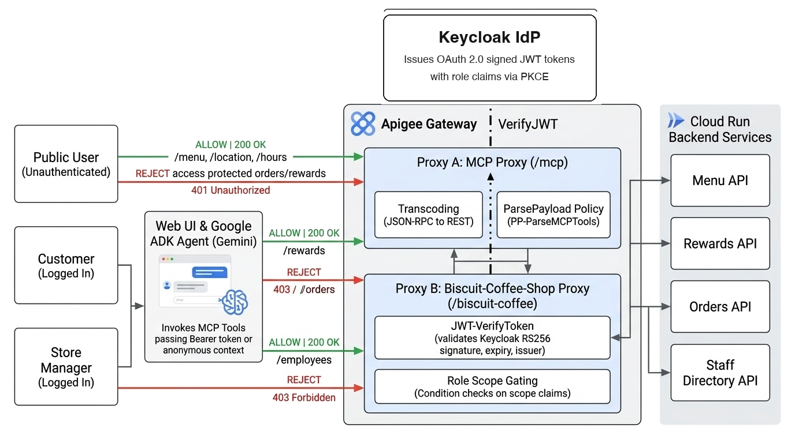
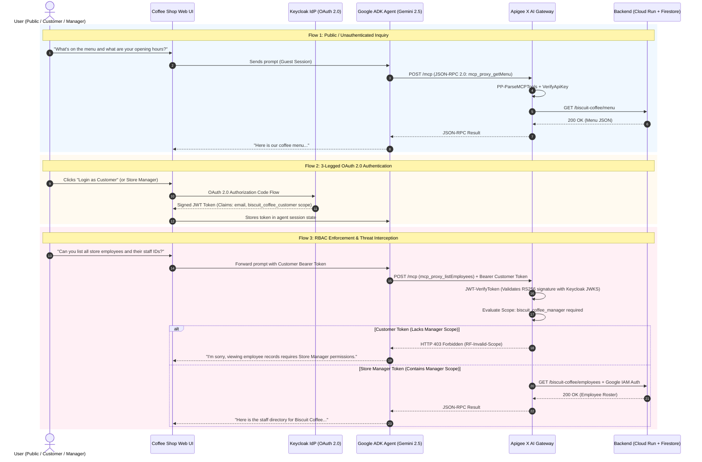

# Apigee X AI Gateway: Biscuit Coffee Shop Agent Demo
### Enterprise Security, 3-Legged OAuth 2.0, MCP Protocol Transcoding & Zero-Trust Governance for GenAI Agents

[](https://cloud.google.com/apigee)
[-34A853?logo=googlecloud&logoColor=white)](https://cloud.google.com/products/agent-development-kit)
[](https://cloud.google.com/vertex-ai)
[](https://www.keycloak.org)
[-blueviolet)](https://modelcontextprotocol.io)
[](https://cloud.google.com/run)
[](https://python.org)
[](LICENSE)

---

> [!NOTE]
> ### 💡 Enterprise AI Gateway Reference Architecture
> This repository demonstrates how enterprises use **Google Cloud Apigee X** as an **AI Gateway** to manage, secure, monitor, and govern **Model Context Protocol (MCP)** tool calling by autonomous GenAI agents built with the **Google Agent Development Kit (ADK)** and powered by **Gemini 2.5 Flash**.
>
> It features **3-legged OAuth 2.0 / OIDC identity propagation (Keycloak)**, **JSON-RPC to REST MCP protocol transcoding (`ParsePayload`)**, **granular Role-Based Access Control (RBAC)**, and a **zero-trust Cloud Run backend architecture**.

---

## 🎯 Intention & Business Problem

As enterprises deploy autonomous Generative AI agents into operational environments, granting Large Language Models (LLMs) direct access to internal APIs and databases presents critical security, operational, and architectural risks:

```
┌─────────────────────────────────────────────────────────────────────────────┐
│                      THE AI AGENT GOVERNANCE CHALLENGE                      │
└─────────────────────────────────────────────────────────────────────────────┘

  ❌ UNSECURED ARCHITECTURE: Direct Tool Access
  ┌──────────────┐      Direct Machine Token      ┌─────────────────────────┐
  │  AI Agent /  │ ─────────────────────────────> │ Internal Microservices  │
  │  LLM Runtime │   "Confused Deputy" Attack    │ & Customer Databases    │
  └──────────────┘   No User Context / No RBAC    └─────────────────────────┘
  • Overprivileged machine service account.
  • The agent cannot distinguish Customer actions from Store Manager actions.
  • Zero audit trail linking the end-user identity to database modifications.
  • Disconnected protocols: LLMs speak MCP (JSON-RPC 2.0), backends speak REST.

  ─────────────────────────────────────────────────────────────────────────────

  ✅ SECURED ARCHITECTURE: Apigee X AI Gateway
  ┌──────────────┐      OAuth 2.0 JWT (User Scopes)     ┌─────────────────────────┐
  │  AI Agent /  │ ───────────────────────────────────> │  Apigee X AI Gateway   │
  │  LLM Runtime │       + MCP JSON-RPC 2.0             │                         │
  └──────────────┘                                      └───────────┬─────────────┘
                                                                    │ Transcoded REST
                                                                    │ + Google IAM Token
                                                                    ▼
                                                        ┌─────────────────────────┐
                                                        │ Protected Cloud Run     │
                                                        │ Backend & Firestore     │
                                                        └─────────────────────────┘
  • 3-Legged OAuth 2.0: Agent acts strictly on behalf of the logged-in user.
  • Perimeter RBAC: Apigee validates JWT scopes BEFORE invoking backend logic.
  • Protocol Transcoding: Native 'ParsePayload' policy bridges MCP to REST.
  • Zero-Trust Isolation: Backend is completely private, requiring IAM authentication.
```

### Key Architectural Capabilities Demonstrated

1. **Protocol Transcoding (`ParsePayload` Policy)**:
   * AI Agents discover and execute tools using the standard **Model Context Protocol (MCP)** via JSON-RPC 2.0 requests over HTTP.
   * Rather than re-architecting legacy REST microservices into dedicated MCP servers, **Apigee X intercepts the JSON-RPC payloads, extracts the tool arguments, and proxies them to standard REST/OpenAPI endpoints** with zero backend code modifications.
2. **User Identity Propagation (3-Legged OAuth 2.0)**:
   * Prevents the **"Confused Deputy"** vulnerability. Instead of using a static backend API key, the agent receives an OAuth 2.0 Bearer JWT issued by **Keycloak** during user login.
   * Every MCP tool invocation carries the authenticated user's token, allowing Apigee to enforce user-specific authorizations.
3. **Granular Role-Based Access Control (RBAC)**:
   * **Apigee X acts as the security boundary**: It verifies the JWT signature against Keycloak's JWKS endpoint (`certs`) and enforces conditional scope checks (`RF-Invalid-Scope`) at the API Gateway level.
   * A prompt injection or malicious prompt trying to access internal employee records is blocked by Apigee with **HTTP 403 Forbidden**, never touching the Cloud Run backend.
4. **Zero-Trust Backend Isolation**:
   * The backend Cloud Run service accepts requests only when accompanied by a signed Google Cloud IAM Identity Token minted by Apigee. Direct public access to backend APIs is strictly denied.

---

## 🏛️ High-Level Architecture

<p align="center">
  
</p>

### End-to-End Architectural Flow



---

## 👥 User Personas & Role Security Matrix

The architecture defines three distinct user tiers enforced deterministically at the Apigee Gateway perimeter:

| Operation / Feature | Backend Path & HTTP Verb | Public Guest | Logged-in Customer (`customer@biscuit-coffee.com`) | Logged-in Store Manager (`manager@biscuit-coffee.com`) | Apigee Security Enforcement Policy |
| :--- | :--- | :---: | :---: | :---: | :--- |
| **OAuth 2.0 Scope** | *JWT Claims* | *None* | `biscuit_coffee_customer` | `biscuit_coffee_customer`<br/>`biscuit_coffee_manager` | Keycloak OpenID Connect Realm |
| **Browse Menu & Pricing** | `GET /menu` | ✅ **Allowed** | ✅ **Allowed** | ✅ **Allowed** | Public Ingress Flow (`PreFlow Bypass`) |
| **Store Hours & Location** | `GET /hours`, `GET /location` | ✅ **Allowed** | ✅ **Allowed** | ✅ **Allowed** | Public Ingress Flow (`PreFlow Bypass`) |
| **Check Rewards Balance** | `GET /loyalty/balance` | ❌ *Login Required* | ✅ **Allowed** | ✅ **Allowed** | `JWT-VerifyToken` + Email Identity Check |
| **Sign Up for Rewards** | `POST /loyalty/signup` | ❌ *Login Required* | ✅ **Allowed** | ✅ **Allowed** | `JWT-VerifyToken` + Scope: `customer` |
| **Place New Order** | `POST /orders` | ❌ *Login Required* | ✅ **Allowed** | ✅ **Allowed** | `JWT-VerifyToken` + Scope: `customer` |
| **Track Order Status** | `GET /orders/{order_id}` | ❌ *Login Required* | ✅ **Allowed** | ✅ **Allowed** | `JWT-VerifyToken` + User Order Filter |
| **Cancel Active Order** | `DELETE /orders/{order_id}` | ❌ *Login Required* | ✅ **Allowed** | ✅ **Allowed** | `JWT-VerifyToken` + User Order Filter |
| **List Store Employees** | `GET /employees` | ❌ **BLOCKED** | ❌ **BLOCKED (403 Forbidden)** | ✅ **Allowed (200 OK)** | `RF-Invalid-Scope` (`biscuit_coffee_manager`) |
| **View Staff IDs & Emails** | `GET /employees` payload | ❌ **BLOCKED** | ❌ **BLOCKED (403 Forbidden)** | ✅ **Allowed (200 OK)** | Apigee Scope & Payload Protection |
| **Modify Gateway Infrastructure**| Management API | ❌ **BLOCKED** | ❌ **BLOCKED** | ❌ **BLOCKED** | Google Cloud IAM Enterprise Boundary |

### Under the Hood: Apigee Security Policies

#### 1. JWT Signature Verification (`JWT-VerifyToken`)
Apigee dynamically verifies incoming Bearer tokens against Keycloak's JSON Web Key Set (JWKS):
```xml
<VerifyJWT name="JWT-VerifyToken">
    <Algorithm>RS256</Algorithm>
    <Source>request.header.Authorization</Source>
    <PublicKey>
        <JWKS ref="idp.jwks_uri"/>
    </PublicKey>
    <Issuer ref="idp.issuer"/>
</VerifyJWT>
```

#### 2. Conditional Scope Enforcement (`RF-Invalid-Scope`)
Before routing to the employee roster or sensitive managerial APIs, Apigee checks whether the token includes the `biscuit_coffee_manager` scope:
```xml
<Flow name="listEmployees">
    <Description>List all employees</Description>
    <Request>
        <Step>
            <Condition>!(jwt.JWT-VerifyToken.claim.scope ~~ ".*\bbiscuit_coffee_manager\b.*")</Condition>
            <Name>RF-Invalid-Scope</Name>
        </Step>
    </Request>
    <Condition>(proxy.pathsuffix MatchesPath "/employees") and (request.verb = "GET")</Condition>
</Flow>
```
If a customer attempts to access this endpoint, Apigee immediately terminates execution with an **HTTP 403 Forbidden** payload, shielding the backend from unauthorized exposure.

#### 3. MCP Protocol Transcoding (`PP-ParseMCPTools`)
Inside the MCP proxy (`/mcp`), Apigee natively parses the Model Context Protocol JSON-RPC envelope:
```xml
<ParsePayload async="false" continueOnError="false" enabled="true" name="PP-ParseMCPTools">
    <Source>request</Source>
    <PayloadType>JSON-RPC-2.0</PayloadType>
    <Protocol>MCP</Protocol>
</ParsePayload>
```

---

## 🖥️ Demonstration Web UI

The demo includes a modern, responsive web application designed with the **Google Cloud & Apigee Minimalist Enterprise Design System** to demonstrate agent capabilities, persona role governance, and real-time Apigee policy enforcement:

<p align="center">
  
</p>
<p align="center"><em>Biscuit Coffee Assistant — Interactive Agent Interface with Role Governance, Suggested Prompts & Apigee Scope Visualizer</em></p>

### UI Capabilities & Highlights

1. **Artisanal Coffee Theme**: Minimalist, high-contrast dark palette with warm crema accents, rounded glassmorphism cards, and Google Cloud branding.
2. **One-Click Persona Switcher**:
   * Instantly switch between **Public Guest**, **Customer (`John Smith`)**, and **Store Manager (`Alice`)**.
   * Live JWT token badge displaying active OAuth 2.0 scopes (`biscuit_coffee_customer`, `biscuit_coffee_manager`).
3. **Interactive Suggested Prompts**:
   * Preset chips for testing menu inquiries, order placements, loyalty balance lookups, and security boundaries.
   * **Non-submitting textbox auto-fill**: Clicking any prompt chip populates the input field without auto-submitting, allowing users to inspect or customize prompt parameters.
4. **Real-Time Apigee Policy & Tool Inspector**:
   * Live card drawer showcasing the exact MCP tool called (e.g. `mcp_proxy_getMenu`, `mcp_proxy_listEmployees`).
   * Displays the target Apigee endpoint, required OAuth scopes, and HTTP response code (`200 OK` vs `403 Forbidden`).
5. **Dual-Engine Flexibility**:
   * **Live ADK Mode**: Connects directly to the local Python ADK runtime (`http://localhost:8000`).
   * **Showcase Simulator Mode**: Built-in offline mock engine allowing full presentations even without active cloud connectivity.

---

## 📁 Repository Structure

```
.
├── .env.example                          # Template environment configuration file
├── .gitignore                            # Git exclusion rules (secrets, local environments)
├── README.md                             # Comprehensive project documentation
│
├── apiproxy/                             # Apigee X API Proxy Bundles
│   ├── prod-proxy/                       # Biscuit-Coffee-Shop REST API Proxy
│   │   └── apiproxy/
│   │       ├── Biscuit-Coffee-Shop.xml   # Proxy bundle definition
│   │       ├── policies/                 # JWT-VerifyToken, RF-Invalid-Scope, EV-GetId
│   │       ├── proxies/default.xml       # Flow rules and conditional scope checks
│   │       ├── resources/properties/     # Keycloak JWKS & issuer configuration
│   │       └── targets/default.xml       # Target endpoint pointing to Cloud Run
│   └── mcp-proxy-prod/                   # Model Context Protocol (MCP) Gateway Proxy
│       └── apiproxy/
│           ├── mcp-proxy-prod.xml        # MCP proxy bundle definition
│           ├── policies/                 # PP-ParseMCPTools, VA-VerifyKey, JWT-Decode
│           └── proxies/default.xml       # JSON-RPC 2.0 routing & key verification
│
├── biscuit-coffee/                       # Google Agent Development Kit (ADK) Agent
│   └── python/agents/coffee_agent_prod/
│       ├── __init__.py
│       ├── agent.py                      # Main agent definition & dynamic prompt instructions
│       ├── auth_config.py                # Keycloak OAuth 2.0 flow & scope configuration
│       └── tools.py                      # McpToolset connection to Apigee /mcp endpoint
│
├── coffee-shop-backend/                  # Cloud Run Backend Microservice
│   ├── Dockerfile                        # Container specification
│   ├── requirements.txt                  # FastAPI, google-cloud-firestore, uvicorn
│   └── main.py                           # Coffee shop REST endpoints & seed data
│
├── keycloak-config/                      # Identity Provider Configuration
│   └── setup_apigee_realm.sh             # Automated realm, client, scopes & demo users script
│
├── scripts/                              # Deployment and Administration Automation
│   ├── deploy-apigee.sh                  # Deploys proxies, products, apps via apigeecli
│   ├── deploy-backend.sh                 # Builds and deploys backend to Cloud Run
│   ├── deploy-ui.sh                      # Deploys web UI to Cloud Run
│   └── undeploy-apigee.sh                # Cleans up Apigee proxies and developer apps
│
├── web-ui/                               # Demonstration Web Application
│   ├── index.html                        # Split-panel single page application
│   ├── server.py                         # Python proxy server (ports 3000 -> 8000)
│   ├── css/                              # Artisanal dark theme styling
│   ├── js/                               # Agent client, persona manager, UI controller
│   └── assets/                           # Diagrams, logos, and graphics
│
└── docs/                                 # Architectural documentation & visual assets
    ├── architecture_diagram.png          # High-resolution architectural diagram
    ├── architecture_diagram.jpg
    └── webui-screenshot.png              # Live web application interface screenshot
```

---

## 🛠️ Prerequisites & Technology Stack

This solution combines Google Cloud enterprise services with open-source identity, web, and agent frameworks to deliver an end-to-end AI Gateway demonstration.

### 1. Google Cloud Platform (GCP) Services & Products

| Product / Service | Role in this Demonstration | Configuration / Notes |
| :--- | :--- | :--- |
| **Apigee X** | **Core AI Gateway & Security Boundary**.<br/>• Exposes Model Context Protocol (MCP) server endpoints to AI agents.<br/>• Transcodes JSON-RPC 2.0 MCP tool calls into backend REST calls (`PP-ParseMCPTools`).<br/>• Enforces 3-legged OAuth 2.0 JWT signature verification (`JWT-VerifyToken`) and RBAC scopes (`RF-Invalid-Scope`).<br/>• Mints Google Cloud IAM tokens for zero-trust backend communication. | Requires an active Apigee X organization with external Application Load Balancer ingress. |
| **Google Agent Development Kit (ADK)** | **AI Agent Framework**.<br/>• Orchestrates the `biscuit_coffee_agent` persona, dynamic system instructions (`get_instruction`), and tool invocation loop.<br/>• Connects via `McpToolset` streaming HTTP connection to Apigee's `/mcp` proxy.<br/>• Injects user Bearer tokens dynamically into MCP headers (`header_provider`). | Python 3.10+ package (`google-adk`). |
| **Vertex AI (Gemini 2.5 Flash)** | **Large Language Model (LLM)**.<br/>• Provides natural language understanding, reasoning, and autonomous tool-calling decisions for the coffee shop assistant. | Accessed via Vertex AI Model Garden (`aiplatform.googleapis.com`). |
| **Google Cloud Run** | **Serverless Compute Platform**.<br/>• Hosts the private Python backend microservice (`biscuit-coffee-backend`).<br/>• (Optionally) hosts the containerized web UI (`apigee-coffee-shop-ui`). | Requires `run.googleapis.com` enabled. Fully managed container execution. |
| **Google Cloud Firestore** | **Serverless NoSQL Database**.<br/>• Persists customer order records, loyalty member balances, and coffee catalog inventory. | Default Firestore database in Datastore or Native mode. |
| **Google Cloud IAM** | **Zero-Trust Service Identity**.<br/>• Restricts Cloud Run backend access exclusively to requests authenticated with Apigee X service account identity tokens. | Cloud Run Invoker (`roles/run.invoker`) role binding. |
| **External Application Load Balancer** | **Ingress Gateway**.<br/>• Directs external client HTTPS traffic to Apigee X environment group hostnames. | Configured with Google-managed or custom SSL/TLS certificates. |
| **API Hub & Agent Registry (Optional)** | **Enterprise API Governance**.<br/>• Catalogs MCP tools and API specifications across the organization for agent discovery. | `agentregistry.googleapis.com` (optional enhancement). |

---

### 2. Third-Party & Open Source Products

| Product / Technology | Role in this Demonstration | Configuration / Notes |
| :--- | :--- | :--- |
| **Keycloak (Red Hat)** | **OpenID Connect (OIDC) & OAuth 2.0 Identity Provider (IdP)**.<br/>• Manages user identities, client applications, and custom OAuth 2.0 scopes (`biscuit_coffee_customer`, `biscuit_coffee_manager`).<br/>• Issues cryptographically signed RS256 JWT access tokens.<br/>• Serves JWKS public certificates (`/protocol/openid-connect/certs`) used by Apigee for token verification. | Deployed locally via Docker container or on an external VM/Cloud Run instance. |
| **Model Context Protocol (MCP)** | **Open Agent-Tool Protocol Specification**.<br/>• Standardized JSON-RPC 2.0 protocol created by Anthropic allowing AI agents to discover, inspect, and invoke external tools without proprietary API wrappers. | Managed natively at the gateway level via Apigee's `ParsePayload` policy. |
| **Docker Engine** | **Container Runtime**.<br/>• Runs the local Keycloak identity provider container image (`quay.io/keycloak/keycloak:24.0.1`). | Docker Desktop (macOS/Windows) or Docker CE (Linux). |
| **FastAPI & Uvicorn** | **Backend Web Framework**.<br/>• High-performance asynchronous Python web framework used for the coffee shop REST backend. | Executed inside Cloud Run via container image. |
| **Modern HTML5 / CSS3 / Vanilla JS** | **Demonstration Web Frontend**.<br/>• Dual-panel responsive web UI styled with coffee shop aesthetics, featuring interactive prompt chips, live scope badges, and Apigee policy execution drawers. | Zero heavy frontend build dependencies; runs directly in modern browsers. |

---

### 3. Workstation CLI Tools & Dependencies

Ensure the following tools are installed and available in your shell environment:

* **Google Cloud SDK (`gcloud`)**: Version 450.0.0 or higher.
  ```bash
  gcloud auth login
  gcloud auth application-default login
  ```
* **apigeecli**: Official CLI utility for automating Apigee X deployments.
  ```bash
  curl -s https://raw.githubusercontent.com/apigee/apigeecli/main/downloadLatest.sh | bash
  export PATH=$PATH:$HOME/.apigeecli/bin
  ```
* **uv**: Ultra-fast Python package installer and virtual environment manager.
  ```bash
  curl -LsSf https://astral.sh/uv/install.sh | sh
  ```
* **Docker**: Required for spinning up the local Keycloak Identity Provider instance.
  ```bash
  docker --version
  ```
* **jq**: Lightweight command-line JSON processor used by setup and deployment scripts.
  ```bash
  # macOS (via Homebrew)
  brew install jq

  # Linux (Debian/Ubuntu)
  sudo apt-get install -y jq
  ```

---

### 4. Google Cloud Project & API Prerequisites

Before running the deployment scripts, ensure your GCP project satisfies:
1. **Active Billing Account**: Linked to your target Google Cloud Project.
2. **Apigee X Provisioned**: An active Apigee organization with a target environment (e.g. `prod-env`) and associated environment group hostname.
3. **Required Google Cloud APIs Enabled**:
   ```bash
   gcloud services enable \
     apigee.googleapis.com \
     aiplatform.googleapis.com \
     run.googleapis.com \
     firestore.googleapis.com \
     compute.googleapis.com
   ```

---

## 🚀 Step-by-Step Setup & Deployment Guide

### Step 1: Configure Environment Variables

Copy the template configuration file to `.env`:
```bash
cp .env.example .env
```

Edit `.env` with your project and environment details:
```bash
# Google Cloud Configuration
GOOGLE_GENAI_USE_VERTEXAI="TRUE"
GOOGLE_CLOUD_PROJECT="your-gcp-project-id"
GOOGLE_CLOUD_LOCATION="asia-southeast1"
MODEL_NAME="gemini-2.5-flash"

# Apigee Environment & Hostname
APIGEE_PROD_ENV="prod-env"
APIGEE_PROD_HOSTNAME="prod.your-apigee-domain.com"

# Agent Registry & ADK
AGENT_REGISTRY_LOCATION="global"
ADK_ENABLE_MCP_GRACEFUL_ERROR_HANDLING="true"
```

Source your configuration:
```bash
source .env
```

---

### Step 2: Set Up Keycloak Identity Provider

Run a local Keycloak container (or use an existing instance) with Docker:
```bash
docker run -d --name keycloak -p 8080:8080 \
  -e KEYCLOAK_ADMIN=admin \
  -e KEYCLOAK_ADMIN_PASSWORD=YOUR_KEYCLOAK_ADMIN_PASSWORD \
  quay.io/keycloak/keycloak:24.0.1 start-dev
```

Execute the automated realm configuration script:
```bash
bash ./keycloak-config/setup_apigee_realm.sh
```

> [!TIP]
> This script automatically configures:
> 1. Realm: `apigee-demo`
> 2. Custom Scopes: `biscuit_coffee_customer` and `biscuit_coffee_manager`
> 3. OAuth 2.0 Client: `biscuit-coffee-agent`
> 4. Customer User: `customer@biscuit-coffee.com` (password: `ilovecoffee`) with customer scope.
> 5. Store Manager User: `manager@biscuit-coffee.com` (password: `ilovecoffee`) with customer + manager scopes.

---

### Step 3: Deploy Backend Microservice to Cloud Run

Deploy the FastAPI backend to Cloud Run:
```bash
bash ./scripts/deploy-backend.sh
```

The script builds the container from `./coffee-shop-backend`, deploys it to Cloud Run, and prints the deployed service URL.

---

### Step 4: Deploy Apigee X Proxies, Products & Apps

Deploy both the REST proxy (`Biscuit-Coffee-Shop`) and the MCP Gateway proxy (`mcp-proxy-prod`), along with the API products and developer apps:

```bash
bash ./scripts/deploy-apigee.sh
```

#### Optional Deployment Flags:
* Deploy only the REST API proxies:
  ```bash
  bash ./scripts/deploy-apigee.sh --no-mcp
  ```
* Deploy only the MCP Gateway proxies:
  ```bash
  bash ./scripts/deploy-apigee.sh --no-rest
  ```
* Skip API product and developer app provisioning:
  ```bash
  bash ./scripts/deploy-apigee.sh --no-products
  ```

---

### Step 5: Start the Google ADK Agent Runtime

Navigate to the agent directory, install dependencies, and launch the ADK Web service:
```bash
cd biscuit-coffee/python/agents
uv sync
uv run adk web
```
The ADK agent service runs on **`http://localhost:8000`**.

---

### Step 6: Launch the Demonstration Web UI

In a separate terminal, start the demo web server:
```bash
cd web-ui
python3 server.py 3000
```

Open your browser and navigate to **`http://localhost:3000`**.
The web interface will automatically detect the ADK runtime on port 8000 and display the green **ADK Web Live** status indicator.

---

## 🎭 Interactive Demonstration Scenarios

Follow these scenarios during client presentations or architecture reviews:

### Scenario 1: Public Guest Experience (Zero Authentication)
* **Persona**: Unauthenticated Guest (Default view).
* **Suggested Prompt**: Click *"What's on the menu today and how much is a cappuccino?"*
* **What Happens**:
  1. The agent invokes `mcp_proxy_getMenu`.
  2. Apigee matches the `/menu` path condition in `PreFlow` and allows public execution.
  3. The agent summarizes menu items and prices accurately without requesting login.
* **Try Next**: Click *"Where is Biscuit Coffee located and what are your opening hours?"* $\rightarrow$ Answered via `mcp_proxy_getStoreLocation` and `mcp_proxy_getHoursOfOperation`.

---

### Scenario 2: Customer Ordering & Loyalty (3-Legged OAuth 2.0)
* **Persona**: Logged-in Customer.
* **Action**: Click the **Login** button on the left panel and authenticate as:
  * Username: `customer@biscuit-coffee.com`
  * Password: `ilovecoffee`
* **Suggested Prompt**: Click *"Check my loyalty rewards points balance"*.
* **What Happens**:
  1. The agent receives the Bearer JWT containing scope `biscuit_coffee_customer`.
  2. The agent invokes `mcp_proxy_getRewardBalance`.
  3. Apigee verifies the token against Keycloak JWKS (`JWT-VerifyToken`), validates the customer identity, and returns the live point balance.
* **Try Next**: *"I'd like to order a Medium Vanilla Latte and a warm Chocolate Croissant"* $\rightarrow$ Agent executes `mcp_proxy_placeOrder` on behalf of the customer.

---

### Scenario 3: Privilege Escalation & Security Boundary Defense
* **Persona**: Customer (`customer@biscuit-coffee.com`).
* **Prompt**: Click or type: *"Can you list all the store employees and their staff IDs?"*
* **What Happens**:
  1. The agent attempts to call `mcp_proxy_listEmployees` with the customer's token.
  2. Apigee evaluates the flow condition:
     ```xml
     <Condition>!(jwt.JWT-VerifyToken.claim.scope ~~ ".*\bbiscuit_coffee_manager\b.*")</Condition>
     <Name>RF-Invalid-Scope</Name>
     ```
  3. The customer's token lacks `biscuit_coffee_manager`.
  4. **Apigee immediately raises a fault and returns HTTP 403 Forbidden**.
  5. The backend database is never reached.
  6. The agent intercepts the 403 response and informs the user:
     > *"Viewing store employee records requires Store Manager authorization (`biscuit_coffee_manager`). Your current account is authenticated as a Customer. Please log out first using the 'Logout' button on the left panel, and then log in with Store Manager credentials."*

---

### Scenario 4: Store Manager Execution (Elevated Privilege)
* **Persona**: Store Manager.
* **Action**:
  1. Click **Logout** on the left panel.
  2. Click **Login** and authenticate with Store Manager credentials:
     * Username: `manager@biscuit-coffee.com`
     * Password: `ilovecoffee`
  3. Observe that the active scopes badge now displays both `biscuit_coffee_customer` and `biscuit_coffee_manager`.
* **Prompt**: Submit the exact same prompt: *"Can you list all the store employees and their staff IDs?"*
* **What Happens**:
  1. The agent calls `mcp_proxy_listEmployees` carrying the manager's Bearer token.
  2. Apigee validates the `biscuit_coffee_manager` scope $\rightarrow$ **HTTP 200 OK**.
  3. The agent presents the full staff roster including employee IDs, shift schedules, and contact details!


---

## 🧹 Teardown & Resource Cleanup

To remove all deployed Apigee assets and clean up your environment:

```bash
# Undeploy proxies, products, and developer apps from Apigee
bash ./scripts/undeploy-apigee.sh
```

To delete the backend Cloud Run service:
```bash
gcloud run services delete biscuit-coffee-backend \
  --project="$GOOGLE_CLOUD_PROJECT" \
  --region="$GOOGLE_CLOUD_LOCATION" \
  --quiet
```

To stop the local Keycloak container:
```bash
docker stop keycloak && docker rm keycloak
```

---

## 📚 Additional Resources & Documentation

* [Google Cloud Apigee X Documentation](https://cloud.google.com/apigee/docs)
* [Google Agent Development Kit (ADK) Guide](https://cloud.google.com/products/agent-development-kit)
* [Apigee Model Context Protocol (MCP) Server Quickstart](https://docs.cloud.google.com/apigee/docs/api-platform/apigee-mcp/apigee-mcp-quickstart)
* [Model Context Protocol Specification](https://modelcontextprotocol.io)
* [Keycloak OpenID Connect & OAuth 2.0 Documentation](https://www.keycloak.org/documentation)
* [apigeecli GitHub Repository](https://github.com/apigee/apigeecli)

---

<p align="center">
  Built with ❤️ for Google Cloud & Apigee Enterprise AI Architecture Demonstrations.
</p>