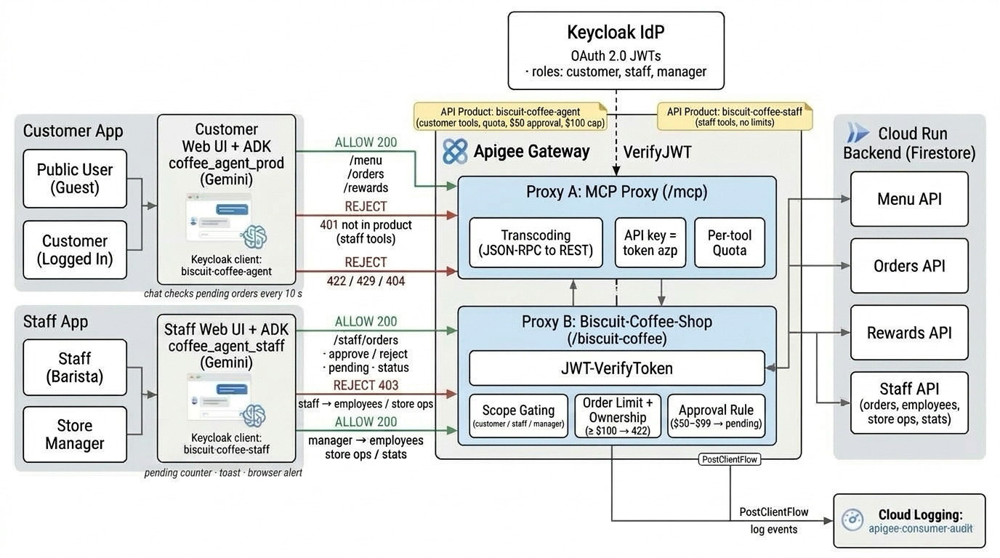
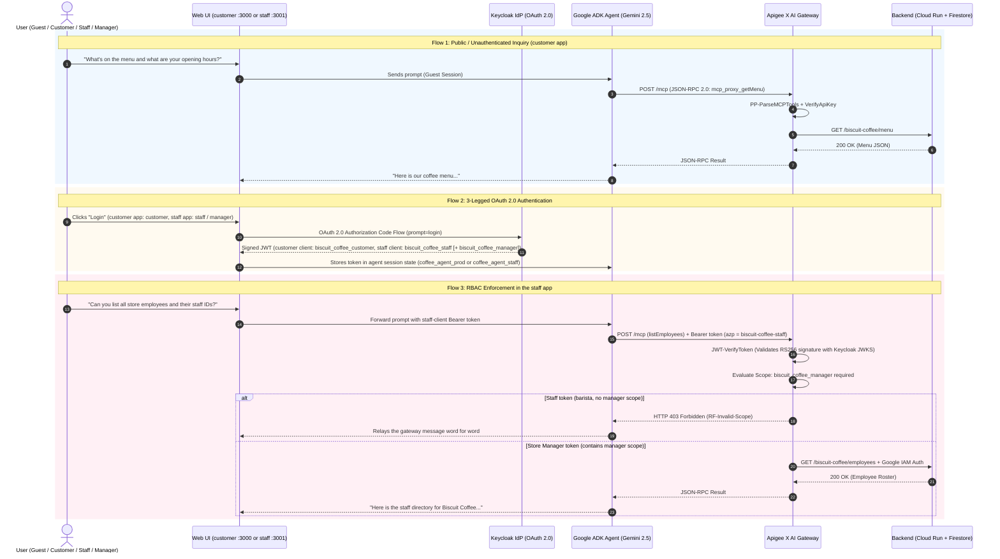
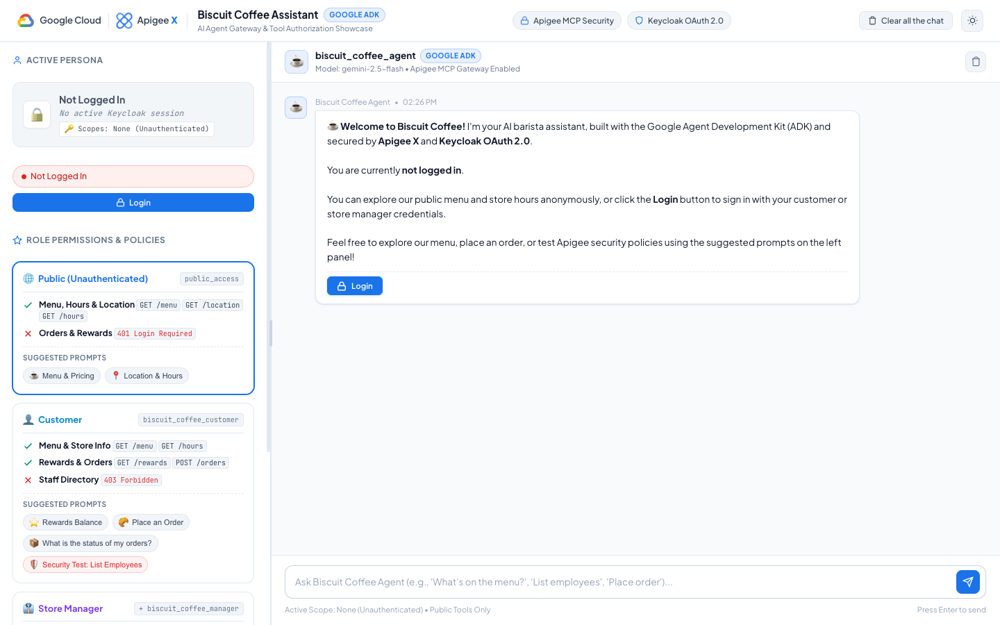

# Apigee X AI Gateway: Biscuit Coffee Shop Agent Demo
### Enterprise Security, 3-Legged OAuth 2.0, MCP Protocol Transcoding & Zero-Trust Governance for GenAI Agents

[](https://cloud.google.com/apigee)
[-34A853?logo=googlecloud&logoColor=white)](https://cloud.google.com/products/agent-development-kit)
[](https://cloud.google.com/vertex-ai)
[](https://www.keycloak.org)
[-blueviolet)](https://modelcontextprotocol.io)
[](https://cloud.google.com/run)
[](https://python.org)
[](LICENSE)

---

> [!NOTE]
> ### 💡 Enterprise AI Gateway Reference Architecture
> This repository demonstrates how enterprises use **Google Cloud Apigee X** as an **AI Gateway** to manage, secure, monitor, and govern **Model Context Protocol (MCP)** tool calling by autonomous GenAI agents built with the **Google Agent Development Kit (ADK)** and powered by **Gemini 2.5 Flash**.
>
> It features **3-legged OAuth 2.0 / OIDC identity propagation (Keycloak)**, **JSON-RPC to REST MCP protocol transcoding (`ParsePayload`)**, **granular Role-Based Access Control (RBAC)**, and a **zero-trust Cloud Run backend architecture**.

---

## 🎯 Intention & Business Problem

As enterprises deploy autonomous Generative AI agents into operational environments, granting Large Language Models (LLMs) direct access to internal APIs and databases presents critical security, operational, and architectural risks:

```
┌─────────────────────────────────────────────────────────────────────────────┐
│                      THE AI AGENT GOVERNANCE CHALLENGE                      │
└─────────────────────────────────────────────────────────────────────────────┘

  ❌ UNSECURED ARCHITECTURE: Direct Tool Access
  ┌──────────────┐      Direct Machine Token      ┌─────────────────────────┐
  │  AI Agent /  │ ─────────────────────────────> │ Internal Microservices  │
  │  LLM Runtime │   "Confused Deputy" Attack    │ & Customer Databases    │
  └──────────────┘   No User Context / No RBAC    └─────────────────────────┘
  • Overprivileged machine service account.
  • The agent cannot distinguish Customer actions from Store Manager actions.
  • Zero audit trail linking the end-user identity to database modifications.
  • Disconnected protocols: LLMs speak MCP (JSON-RPC 2.0), backends speak REST.

  ─────────────────────────────────────────────────────────────────────────────

  ✅ SECURED ARCHITECTURE: Apigee X AI Gateway
  ┌──────────────┐      OAuth 2.0 JWT (User Scopes)     ┌─────────────────────────┐
  │  AI Agent /  │ ───────────────────────────────────> │  Apigee X AI Gateway   │
  │  LLM Runtime │       + MCP JSON-RPC 2.0             │                         │
  └──────────────┘                                      └───────────┬─────────────┘
                                                                    │ Transcoded REST
                                                                    │ + Google IAM Token
                                                                    ▼
                                                        ┌─────────────────────────┐
                                                        │ Protected Cloud Run     │
                                                        │ Backend & Firestore     │
                                                        └─────────────────────────┘
  • 3-Legged OAuth 2.0: Agent acts strictly on behalf of the logged-in user.
  • Perimeter RBAC: Apigee validates JWT scopes BEFORE invoking backend logic.
  • Protocol Transcoding: Native 'ParsePayload' policy bridges MCP to REST.
  • Zero-Trust Isolation: Backend is completely private, requiring IAM authentication.
```

### Key Architectural Capabilities Demonstrated

1. **Protocol Transcoding (`ParsePayload` Policy)**:
   * AI Agents discover and execute tools using the standard **Model Context Protocol (MCP)** via JSON-RPC 2.0 requests over HTTP.
   * Rather than re-architecting legacy REST microservices into dedicated MCP servers, **Apigee X intercepts the JSON-RPC payloads, extracts the tool arguments, and proxies them to standard REST/OpenAPI endpoints** with zero backend code modifications.
2. **User Identity Propagation (3-Legged OAuth 2.0)**:
   * Prevents the **"Confused Deputy"** vulnerability. Instead of using a static backend API key, the agent receives an OAuth 2.0 Bearer JWT issued by **Keycloak** during user login.
   * Every MCP tool invocation carries the authenticated user's token, allowing Apigee to enforce user-specific authorizations.
3. **Granular Role-Based Access Control (RBAC)**:
   * **Apigee X acts as the security boundary**: It verifies the JWT signature against Keycloak's JWKS endpoint (`certs`) and enforces conditional scope checks (`RF-Invalid-Scope`) at the API Gateway level.
   * A prompt injection or malicious prompt trying to access internal employee records is blocked by Apigee with **HTTP 403 Forbidden**, never touching the Cloud Run backend.
4. **Zero-Trust Backend Isolation**:
   * The backend Cloud Run service accepts requests only when accompanied by a signed Google Cloud IAM Identity Token minted by Apigee. Direct public access to backend APIs is strictly denied.

---

## 🧑‍🤝‍🧑 Customer App vs Staff App

Customers and store staff use **two separate web apps**, each with its own Keycloak client, Apigee developer-app key, API product and ADK agent. Store staff and managers can't sign in to the customer app; customers can't sign in to the staff app.

| | **Customer app** | **Staff app** |
| :--- | :--- | :--- |
| Who | Guests and customers | Store staff (baristas) and store managers |
| Local URL | `http://localhost:3000` | `http://localhost:3001` |
| Cloud Run service | `apigee-coffee-shop-ui` | `apigee-coffee-shop-staff-ui` |
| Web UI variant | `UI_VARIANT=customer` (default) | `UI_VARIANT=staff` |
| ADK agent (same ADK service) | `coffee_agent_prod` | `coffee_agent_staff` |
| Keycloak client | `biscuit-coffee-agent` | `biscuit-coffee-staff` (confidential) |
| Scopes in the token | `biscuit_coffee_customer` | `biscuit_coffee_staff` (+ `biscuit_coffee_manager` for managers) |
| Apigee developer app → key | `biscuit-coffee-agent-app` → `biscuit-coffee-agent` | `biscuit-coffee-admin-app` → `biscuit-coffee-staff` |
| API product | `biscuit-coffee-agent` (customer tools only, per-tool quota, `maxOrderAmount`, `approvalThreshold`) | `biscuit-coffee-staff` (staff tools, **no quota, no order limits**, `enforceOrderOwnership=false`) |
| Guest mode | Yes (menu, hours, location) | No, sign-in required |
| Who is refused at login | Users with the `staff` or `manager` role | Users without the `staff` / `manager` role or scope |

Both apps open the Keycloak login pop-up with `prompt=login`, so each app always asks for credentials. That lets you sign in as a customer in one window and as staff in another.

### Keycloak identities

| Item | Value |
| :--- | :--- |
| Realm role | `staff` (managers hold `manager` + `staff`) |
| Client scope | `biscuit_coffee_staff`, role-gated to `staff`. `biscuit_coffee_manager` is role-gated to `manager` |
| Staff client | `biscuit-coffee-staff`, audience `biscuit-coffee`, default scopes `biscuit_coffee_staff` + `biscuit_coffee_manager` |
| Demo users (password `ilovecoffee`) | `staff@biscuit-coffee.com` (Sam Barista, staff), `manager@biscuit-coffee.com` (store manager), `customer@`, `customer2@`, `customer3@biscuit-coffee.com` (customers) |

The token's `azp` claim (the Keycloak client id) is the Apigee API key: `mcp-proxy-prod` verifies the key from `azp`. That way a staff token can only reach the staff product, and a customer token only the customer product.

### Staff tools and permissions

The staff agent and the staff UI panels call these MCP tools on `https://<APIGEE_PROD_HOSTNAME>/mcp`. They are backed by `/staff/...` REST operations on the `Biscuit-Coffee-Shop` proxy, which checks the scope for each operation:

| MCP tool | REST operation | Staff (`biscuit_coffee_staff`) | Manager (`biscuit_coffee_manager`) |
| :--- | :--- | :---: | :---: |
| `getMenu`, `getHoursOfOperation`, `getStoreLocation` | `GET /menu`, `/hours`, `/location` | ✅ | ✅ |
| `listAllOrders` | `GET /staff/orders?status=&customer=&limit=` | ✅ | ✅ |
| `getAnyOrder` | `GET /staff/orders/{order_id}` | ✅ | ✅ |
| `decideOrder` (approve / reject) | `POST /staff/orders/{order_id}/decision` | ✅ | ✅ |
| `updateOrderStatus` (`IN_PROGRESS` → `READY` → `COMPLETED`, or `CANCELLED`) | `POST /staff/orders/{order_id}/status` | ✅ | ✅ |
| `listEmployees` | `GET /employees` | ❌ 403 | ✅ |
| `getEmployee` | `GET /staff/employees/{employee_id}` | ❌ 403 | ✅ |
| `updateStoreHours` | `PUT /staff/store/hours` | ❌ 403 | ✅ |
| `updateMenuItem` (price, name, sold out) | `PATCH /staff/menu/{item_id}` | ❌ 403 | ✅ |
| `getSalesStats` | `GET /staff/stats?days=7` | ❌ 403 | ✅ |

`decideOrder` is the only way to decide a `PENDING_APPROVAL` order. It goes straight to the backend through Apigee, and the status is final at once (`IN_PROGRESS` or `REJECTED`). There is no e-mail approval and no expiry. Sold-out items (`available: false`) are shown on the customer menu and refused by `POST /orders`.

### One ADK service, two agents

The ADK container runs `adk web` over `biscuit-coffee/python/agents/`, so one Cloud Run service (`apigee-coffee-shop-adk`) serves both apps; `GET /list-apps` returns `["coffee_agent_prod", "coffee_agent_staff"]`. Shared code (Apigee header provider, MCP 429/401/403 passthrough, gateway-message relay) lives in `agents/biscuit_common.py`. It is a module file, not a folder, so ADK does not list it as an app.

* `coffee_agent_prod`: tool filter = customer tools only (`getMenu`, `getStoreLocation`, `getHoursOfOperation`, `placeOrder`, `getOrder`, `listOrders`, `cancelOrder`, `signUpLoyalty`, `getRewardBalance`, payment tools). No employee or staff tools.
* `coffee_agent_staff`: tool filter = the staff tools above. Its instructions depend on the role in the token (manager / staff / not signed in). It asks for confirmation before rejecting or cancelling an order, changing a price, marking an item sold out or changing hours. It relays Apigee refusals word for word (e.g. a barista asking for employees gets the gateway's 403 message).

Reaching the staff agent alone gives nothing: every tool call still needs a staff token, and Apigee checks it.

> [!NOTE]
> Every ADK deploy restarts both agents and clears their in-memory sessions.

---

## 🏛️ High-Level Architecture

<p align="center">
  
</p>

Older diagrams: [v4 (with Application Integration approvals)](docs/architecture_diagram_v4.png), [original single-app diagram](docs/architecture_diagram.png).

### End-to-End Architectural Flow



In the customer app, the customer agent has no employee or staff tools at all, so a customer asking for employees is told to use the staff app.

---

## 👥 User Personas & Role Security Matrix

The architecture defines four user tiers enforced deterministically at the Apigee Gateway perimeter. Guests and customers use the customer app; staff and managers use the staff app (see [Customer App vs Staff App](#-customer-app-vs-staff-app) for the full staff tool matrix):

| Operation / Feature | Backend Path & HTTP Verb | Public Guest (customer app) | Customer (`customer@biscuit-coffee.com`, customer app) | Staff (`staff@biscuit-coffee.com`, staff app) | Store Manager (`manager@biscuit-coffee.com`, staff app) | Apigee Security Enforcement Policy |
| :--- | :--- | :---: | :---: | :---: | :---: | :--- |
| **OAuth 2.0 Scope** | *JWT Claims* | *None* | `biscuit_coffee_customer` | `biscuit_coffee_staff` | `biscuit_coffee_staff`<br/>`biscuit_coffee_manager` | Keycloak OpenID Connect Realm |
| **Browse Menu & Pricing** | `GET /menu` | ✅ **Allowed** | ✅ **Allowed** | ✅ **Allowed** | ✅ **Allowed** | Public Ingress Flow (`PreFlow Bypass`) |
| **Store Hours & Location** | `GET /hours`, `GET /location` | ✅ **Allowed** | ✅ **Allowed** | ✅ **Allowed** | ✅ **Allowed** | Public Ingress Flow (`PreFlow Bypass`) |
| **Check Rewards Balance** | `GET /loyalty/balance` | ❌ *Login Required* | ✅ **Allowed** | ➖ *Not in staff app* | ➖ *Not in staff app* | `JWT-VerifyToken` + Email Identity Check |
| **Sign Up for Rewards** | `POST /loyalty/signup` | ❌ *Login Required* | ✅ **Allowed** | ➖ | ➖ | `JWT-VerifyToken` + Scope: `customer` |
| **Place New Order** | `POST /orders` | ❌ *Login Required* | ✅ **Allowed** | ➖ | ➖ | `JWT-VerifyToken` + Scope: `customer` |
| **Track / Cancel Own Order** | `GET` / `DELETE /orders/{order_id}` | ❌ *Login Required* | ✅ **Allowed** (own orders only) | ➖ | ➖ | `JWT-VerifyToken` + User Order Filter |
| **All Orders, Approve / Reject, Order Progress** | `/staff/orders/...` | ❌ | ❌ *Not in customer product* | ✅ **Allowed** | ✅ **Allowed** | Staff product + Scope: `staff` or `manager` |
| **List Store Employees** | `GET /employees` | ❌ **BLOCKED** | ❌ *Not in customer agent* | ❌ **BLOCKED (403 Forbidden)** | ✅ **Allowed (200 OK)** | `RF-Invalid-Scope` (`biscuit_coffee_manager`) |
| **Store Ops (hours, prices, sold out, stats)** | `/staff/store/hours`, `/staff/menu/{id}`, `/staff/stats` | ❌ | ❌ | ❌ **BLOCKED (403 Forbidden)** | ✅ **Allowed** | Scope: `biscuit_coffee_manager` |
| **Modify Gateway Infrastructure**| Management API | ❌ **BLOCKED** | ❌ **BLOCKED** | ❌ **BLOCKED** | ❌ **BLOCKED** | Google Cloud IAM Enterprise Boundary |

### Under the Hood: Apigee Security Policies

#### 1. JWT Signature Verification (`JWT-VerifyToken`)
Apigee dynamically verifies incoming Bearer tokens against Keycloak's JSON Web Key Set (JWKS):
```xml
<VerifyJWT name="JWT-VerifyToken">
    <Algorithm>RS256</Algorithm>
    <Source>request.header.Authorization</Source>
    <PublicKey>
        <JWKS ref="idp.jwks_uri"/>
    </PublicKey>
    <Issuer ref="idp.issuer"/>
</VerifyJWT>
```

#### 2. Conditional Scope Enforcement (`RF-Invalid-Scope`)
Before routing to the employee roster or sensitive managerial APIs, Apigee checks whether the token includes the `biscuit_coffee_manager` scope:
```xml
<Flow name="listEmployees">
    <Description>List all employees</Description>
    <Request>
        <Step>
            <Condition>!(jwt.JWT-VerifyToken.claim.scope ~~ ".*\bbiscuit_coffee_manager\b.*")</Condition>
            <Name>RF-Invalid-Scope</Name>
        </Step>
    </Request>
    <Condition>(proxy.pathsuffix MatchesPath "/employees") and (request.verb = "GET")</Condition>
</Flow>
```
If a customer attempts to access this endpoint, Apigee immediately terminates execution with an **HTTP 403 Forbidden** payload, shielding the backend from unauthorized exposure.

#### 3. MCP Protocol Transcoding (`PP-ParseMCPTools`)
Inside the MCP proxy (`/mcp`), Apigee natively parses the Model Context Protocol JSON-RPC envelope:
```xml
<ParsePayload async="false" continueOnError="false" enabled="true" name="PP-ParseMCPTools">
    <Source>request</Source>
    <PayloadType>JSON-RPC-2.0</PayloadType>
    <Protocol>MCP</Protocol>
</ParsePayload>
```

---

## 🖥️ Demonstration Web UI

The demo includes a modern, responsive web application designed with the **Google Cloud & Apigee Minimalist Enterprise Design System** to demonstrate agent capabilities, persona role governance, and real-time Apigee policy enforcement:

<p align="center">
  
</p>
<p align="center"><em>Biscuit Coffee Assistant — Interactive Agent Interface with Role Governance, Suggested Prompts & Apigee Scope Visualizer</em></p>

### UI Capabilities & Highlights

1. **Artisanal Coffee Theme**: Minimalist, high-contrast dark palette with warm crema accents, rounded glassmorphism cards, and Google Cloud branding.
2. **Two Apps, One Codebase**:
   * **Customer app** (`:3000`): **Public Guest** and **Customer** (`John Smith`). Staff and manager accounts are refused at login.
   * **Staff app** (`:3001`, `UI_VARIANT=staff`): **Staff** (`Sam Barista`) and **Store Manager** (`Alice`). It has an orders board (pending / in progress / ready / done, all customers, auto-refresh), approve/reject and order-progress buttons, and, for managers only, employees, store operations (hours, menu price / sold out, sales stats) and the Settings / audit drawer.
   * Live JWT token badge displaying active OAuth 2.0 scopes (`biscuit_coffee_customer`, `biscuit_coffee_staff`, `biscuit_coffee_manager`).
3. **Interactive Suggested Prompts**:
   * Preset chips for testing menu inquiries, order placements, loyalty balance lookups, and security boundaries.
   * **Non-submitting textbox auto-fill**: Clicking any prompt chip populates the input field without auto-submitting, allowing users to inspect or customize prompt parameters.
4. **Real-Time Apigee Policy & Tool Inspector**:
   * Live card drawer showcasing the exact MCP tool called (e.g. `mcp_proxy_getMenu`, `mcp_proxy_listEmployees`).
   * Displays the target Apigee endpoint, required OAuth scopes, and HTTP response code (`200 OK` vs `403 Forbidden`).
5. **Dual-Engine Flexibility**:
   * **Live ADK Mode**: Connects directly to the local Python ADK runtime (`http://localhost:8000`).
   * **Showcase Simulator Mode**: Built-in offline mock engine allowing full presentations even without active cloud connectivity.
6. **Settings Panel (Hosting & Consumer Audit)**:
   * Shows where the UI runs and what it talks to: Apigee proxies, deployments, API products, developer apps and the Cloud Run backend.
   * Consumer audit dashboard built from the `apigee-consumer-audit` Cloud Logging log, with filters and paging.
   * Read-only and fetched server-side with Application Default Credentials. E-mail addresses are masked and API keys appear only as SHA-256 fingerprints.
7. **Guided Tour** (customer app): Step-by-step missions (architecture, guest access, login wall, customer flows, and a hand-off to the Staff app) that walk presenters through the demo.

---

## 📁 Repository Structure

```
.
├── .agents/rules/                        # Agent guardrails (GitHub push workflow, Cloud Run deploys)
├── .env.example                          # Template environment configuration file
├── .gitignore                            # Git exclusion rules (secrets, local environments)
├── README.md                             # Comprehensive project documentation
│
├── apiproxy/                             # Apigee X API Proxy Bundles
│   ├── prod-proxy/                       # Biscuit-Coffee-Shop REST API Proxy
│   │   └── apiproxy/
│   │       ├── Biscuit-Coffee-Shop.xml   # Proxy bundle definition
│   │       ├── policies/                 # JWT-VerifyToken, RF-Invalid-Scope, EV-GetId
│   │       ├── proxies/default.xml       # Flow rules and conditional scope checks
│   │       ├── resources/properties/     # Keycloak JWKS & issuer configuration
│   │       └── targets/default.xml       # Target endpoint pointing to Cloud Run
│   └── mcp-proxy-prod/                   # Model Context Protocol (MCP) Gateway Proxy
│       └── apiproxy/
│           ├── mcp-proxy-prod.xml        # MCP proxy bundle definition
│           ├── policies/                 # PP-ParseMCPTools, VA-VerifyKey, JWT-Decode
│           └── proxies/default.xml       # JSON-RPC 2.0 routing & key verification
│
├── biscuit-coffee/                       # Google Agent Development Kit (ADK) service (one service, two agents)
│   ├── Dockerfile                        # `adk web` over python/agents (serves both agents)
│   └── python/agents/
│       ├── biscuit_common.py             # Shared helpers: header provider, MCP 429/401/403 passthrough, relay
│       ├── coffee_agent_prod/            # Customer agent (customer tools only)
│       │   ├── agent.py                  # Agent definition & dynamic prompt instructions
│       │   ├── auth_config.py            # Keycloak client biscuit-coffee-agent (API key)
│       │   └── tools.py                  # McpToolset + customer tool filter
│       └── coffee_agent_staff/           # Staff / store-manager agent (staff tools)
│           ├── agent.py                  # Role-aware instructions (manager / staff / signed out)
│           ├── auth_config.py            # Keycloak client biscuit-coffee-staff (API key)
│           └── tools.py                  # McpToolset + staff tool filter
│
├── config/                               # Apigee API product operation configs
│   ├── agent-product-ops.json            # biscuit-coffee-agent (customer tools, quotas, order limits)
│   ├── admin-product-ops.json            # biscuit-coffee-admin
│   └── staff-product-ops.json            # biscuit-coffee-staff (staff tools, no limits)
│
├── coffee-shop-backend/                  # Cloud Run Backend Microservice
│   ├── Dockerfile                        # Container specification
│   ├── requirements.txt                  # FastAPI, google-cloud-firestore, uvicorn
│   └── main.py                           # Coffee shop REST endpoints (incl. /staff/...) & seed data
│
├── keycloak-config/                      # Identity Provider Configuration
│   ├── setup_apigee_realm.sh             # Automated realm, client, scopes & demo users script
│   ├── setup_dev_client.sh               # Creates the isolated dev client (biscuit-coffee-agent-dev)
│   └── setup_staff_client.sh             # Staff role/scope, client biscuit-coffee-staff, staff demo user
│
├── scripts/                              # Deployment and Administration Automation
│   ├── deploy-apigee.sh                  # Deploys proxies, products (incl. staff), apps & keys via apigeecli
│   ├── deploy-apigee-dev.sh              # Deploys to the isolated dev environment only (never prod)
│   ├── deploy-backend.sh                 # Builds and deploys backend to Cloud Run
│   ├── deploy-ui.sh                      # Deploys a web UI to Cloud Run: `customer` (default) or `staff`
│   ├── deploy-adk.sh                     # Deploys the ADK web service (both agents) to Cloud Run
│   ├── test-dev-audit.py                 # Dev-environment test harness (quota, large order, roles)
│   └── undeploy-apigee.sh                # Cleans up Apigee proxies and developer apps
│
├── web-ui/                               # Demonstration Web Application (customer + staff variants)
│   ├── index.html                        # Split-panel single page application
│   ├── server.py                         # Python BFF/proxy (UI_VARIANT=customer :3000 | staff :3001)
│   ├── settings_api.py                   # Server-side data for the Settings panel (hosting + audit logs)
│   ├── css/                              # Artisanal dark theme, settings & tour styling
│   ├── js/                               # Agent client, persona manager, UI controller, settings panel
│   │   └── tour/                         # Guided tour engine & missions
│   └── assets/                           # Diagrams, logos, and graphics
│
└── docs/                                 # Architectural documentation & visual assets
    ├── architecture_diagram.png          # Older: original architecture diagram (single app)
    ├── architecture_diagram_v4.png       # Older: Customer + Staff app with Application Integration approvals
    ├── architecture_diagram_v5.png       # Current diagram: Customer + Staff app, approvals in the staff app
    └── webui-screenshot.png              # Live web application interface screenshot
```

---

## 🛠️ Prerequisites & Technology Stack

This solution combines Google Cloud enterprise services with open-source identity, web, and agent frameworks to deliver an end-to-end AI Gateway demonstration.

### 1. Google Cloud Platform (GCP) Services & Products

| Product / Service | Role in this Demonstration | Configuration / Notes |
| :--- | :--- | :--- |
| **Apigee X** | **Core AI Gateway & Security Boundary**.<br/>• Exposes Model Context Protocol (MCP) server endpoints to AI agents.<br/>• Transcodes JSON-RPC 2.0 MCP tool calls into backend REST calls (`PP-ParseMCPTools`).<br/>• Enforces 3-legged OAuth 2.0 JWT signature verification (`JWT-VerifyToken`) and RBAC scopes (`RF-Invalid-Scope`).<br/>• Mints Google Cloud IAM tokens for zero-trust backend communication. | Requires an active Apigee X organization with external Application Load Balancer ingress. |
| **Google Agent Development Kit (ADK)** | **AI Agent Framework**.<br/>• Orchestrates two agents in one service: `coffee_agent_prod` (customer) and `coffee_agent_staff` (staff / store manager), each with dynamic system instructions (`get_instruction`) and a tool filter.<br/>• Connects via `McpToolset` streaming HTTP connection to Apigee's `/mcp` proxy.<br/>• Injects user Bearer tokens dynamically into MCP headers (`header_provider`). | Python 3.10+ package (`google-adk`). |
| **Vertex AI (Gemini 2.5 Flash)** | **Large Language Model (LLM)**.<br/>• Provides natural language understanding, reasoning, and autonomous tool-calling decisions for the coffee shop assistant. | Accessed via Vertex AI Model Garden (`aiplatform.googleapis.com`). |
| **Google Cloud Run** | **Serverless Compute Platform**.<br/>• Hosts the private Python backend microservice (`biscuit-coffee-backend`).<br/>• (Optionally) hosts the containerized web UIs (`apigee-coffee-shop-ui`, `apigee-coffee-shop-staff-ui`) and the ADK service (`apigee-coffee-shop-adk`). | Requires `run.googleapis.com` enabled. Fully managed container execution. |
| **Google Cloud Firestore** | **Serverless NoSQL Database**.<br/>• Persists customer order records, loyalty member balances, and coffee catalog inventory. | Default Firestore database in Datastore or Native mode. |
| **Google Cloud IAM** | **Zero-Trust Service Identity**.<br/>• Restricts Cloud Run backend access exclusively to requests authenticated with Apigee X service account identity tokens. | Cloud Run Invoker (`roles/run.invoker`) role binding. |
| **External Application Load Balancer** | **Ingress Gateway**.<br/>• Directs external client HTTPS traffic to Apigee X environment group hostnames. | Configured with Google-managed or custom SSL/TLS certificates. |
| **API Hub & Agent Registry (Optional)** | **Enterprise API Governance**.<br/>• Catalogs MCP tools and API specifications across the organization for agent discovery. | `agentregistry.googleapis.com` (optional enhancement). |

---

### 2. Third-Party & Open Source Products

| Product / Technology | Role in this Demonstration | Configuration / Notes |
| :--- | :--- | :--- |
| **Keycloak (Red Hat)** | **OpenID Connect (OIDC) & OAuth 2.0 Identity Provider (IdP)**.<br/>• Manages user identities, client applications (`biscuit-coffee-agent`, `biscuit-coffee-staff`), realm roles and custom OAuth 2.0 scopes (`biscuit_coffee_customer`, `biscuit_coffee_staff`, `biscuit_coffee_manager`).<br/>• Issues cryptographically signed RS256 JWT access tokens.<br/>• Serves JWKS public certificates (`/protocol/openid-connect/certs`) used by Apigee for token verification. | Deployed locally via Docker container or on an external VM/Cloud Run instance. |
| **Model Context Protocol (MCP)** | **Open Agent-Tool Protocol Specification**.<br/>• Standardized JSON-RPC 2.0 protocol created by Anthropic allowing AI agents to discover, inspect, and invoke external tools without proprietary API wrappers. | Managed natively at the gateway level via Apigee's `ParsePayload` policy. |
| **Docker Engine** | **Container Runtime**.<br/>• Runs the local Keycloak identity provider container image (`quay.io/keycloak/keycloak:24.0.1`). | Docker Desktop (macOS/Windows) or Docker CE (Linux). |
| **FastAPI & Uvicorn** | **Backend Web Framework**.<br/>• High-performance asynchronous Python web framework used for the coffee shop REST backend. | Executed inside Cloud Run via container image. |
| **Modern HTML5 / CSS3 / Vanilla JS** | **Demonstration Web Frontend**.<br/>• Dual-panel responsive web UI styled with coffee shop aesthetics, featuring interactive prompt chips, live scope badges, and Apigee policy execution drawers. | Zero heavy frontend build dependencies; runs directly in modern browsers. |

---

### 3. Workstation CLI Tools & Dependencies

Ensure the following tools are installed and available in your shell environment:

* **Google Cloud SDK (`gcloud`)**: Version 450.0.0 or higher.
  ```bash
  gcloud auth login
  gcloud auth application-default login
  ```
* **apigeecli**: Official CLI utility for automating Apigee X deployments.
  ```bash
  curl -s https://raw.githubusercontent.com/apigee/apigeecli/main/downloadLatest.sh | bash
  export PATH=$PATH:$HOME/.apigeecli/bin
  ```
* **uv**: Ultra-fast Python package installer and virtual environment manager.
  ```bash
  curl -LsSf https://astral.sh/uv/install.sh | sh
  ```
* **Docker**: Required for spinning up the local Keycloak Identity Provider instance.
  ```bash
  docker --version
  ```
* **jq**: Lightweight command-line JSON processor used by setup and deployment scripts.
  ```bash
  # macOS (via Homebrew)
  brew install jq

  # Linux (Debian/Ubuntu)
  sudo apt-get install -y jq
  ```

---

### 4. Google Cloud Project & API Prerequisites

Before running the deployment scripts, ensure your GCP project satisfies:
1. **Active Billing Account**: Linked to your target Google Cloud Project.
2. **Apigee X Provisioned**: An active Apigee organization with a target environment (e.g. `prod-env`) and associated environment group hostname.
3. **Required Google Cloud APIs Enabled**:
   ```bash
   gcloud services enable \
     apigee.googleapis.com \
     aiplatform.googleapis.com \
     run.googleapis.com \
     firestore.googleapis.com \
     compute.googleapis.com \
     secretmanager.googleapis.com
   ```

---

## 🚀 Step-by-Step Setup & Deployment Guide

### Step 1: Configure Environment Variables

Copy the template configuration file to `.env`:
```bash
cp .env.example .env
```

Edit `.env` with your project and environment details:
```bash
# Google Cloud Configuration
GOOGLE_GENAI_USE_VERTEXAI="TRUE"
GOOGLE_CLOUD_PROJECT="your-gcp-project-id"
GOOGLE_CLOUD_LOCATION="asia-southeast1"
MODEL_NAME="gemini-3.5-flash-lite"

# Apigee Environment & Hostname
APIGEE_PROD_ENV="prod-env"
APIGEE_PROD_HOSTNAME="prod.your-apigee-domain.com"

# Agent Registry & ADK
AGENT_REGISTRY_LOCATION="global"
ADK_ENABLE_MCP_GRACEFUL_ERROR_HANDLING="true"

# Keycloak OAuth client secret (local runs only; never commit it).
# Get it from the Keycloak admin console after Step 2.
KEYCLOAK_CLIENT_SECRET="<your-keycloak-client-secret>"

# Staff app Keycloak client (local runs only; never commit the secret).
KEYCLOAK_STAFF_CLIENT_ID="biscuit-coffee-staff"
KEYCLOAK_STAFF_CLIENT_SECRET="<your-staff-client-secret>"
```

Source your configuration:
```bash
source .env
```

---

### Step 2: Set Up Keycloak Identity Provider

Run a local Keycloak container (or use an existing instance) with Docker:
```bash
docker run -d --name keycloak -p 8080:8080 \
  -e KEYCLOAK_ADMIN=admin \
  -e KEYCLOAK_ADMIN_PASSWORD=YOUR_KEYCLOAK_ADMIN_PASSWORD \
  quay.io/keycloak/keycloak:24.0.1 start-dev
```

Execute the automated realm configuration script:
```bash
bash ./keycloak-config/setup_apigee_realm.sh
```

> [!TIP]
> This script automatically configures:
> 1. Realm: `apigee-demo`
> 2. Custom Scopes: `biscuit_coffee_customer` and `biscuit_coffee_manager`
> 3. OAuth 2.0 Client: `biscuit-coffee-agent`
> 4. Customer User: `customer@biscuit-coffee.com` (password: `ilovecoffee`) with customer scope.
> 5. Store Manager User: `manager@biscuit-coffee.com` (password: `ilovecoffee`) with the `manager` role. Managers sign in to the **staff app** (the customer app refuses them); `setup_staff_client.sh` below adds the `staff` role.
> 6. Extra Customer Users: `customer2@biscuit-coffee.com` (Michael, used by the tour's order-ownership mission) and `customer3@biscuit-coffee.com` (password: `ilovecoffee`) with customer scope.

Then add the staff app identities (additive only: the customer client and its scopes are not touched):
```bash
# Prompts keep both secrets out of shell history.
read -rs KC_ADMIN_PASS; export KC_ADMIN_PASS
read -rs STAFF_CLIENT_SECRET; export STAFF_CLIENT_SECRET
# Optional: STAFF_UI_URL=https://apigee-coffee-shop-staff-ui-xxxx.run.app adds the Cloud Run redirect URI
bash ./keycloak-config/setup_staff_client.sh
```

> [!TIP]
> `setup_staff_client.sh` creates the realm role `staff`, the role-gated client scope `biscuit_coffee_staff`, the confidential client `biscuit-coffee-staff` (audience `biscuit-coffee`, default scopes `biscuit_coffee_staff` + `biscuit_coffee_manager`, redirects `http://localhost:3001/*` and `http://127.0.0.1:3001/*`) and the demo user `staff@biscuit-coffee.com` (password `ilovecoffee`). It also grants `staff` to `manager@biscuit-coffee.com`. Put the same client secret in your local `.env` as `KEYCLOAK_STAFF_CLIENT_SECRET`.

---

### Step 3: Deploy Backend Microservice to Cloud Run

Deploy the FastAPI backend to Cloud Run:
```bash
bash ./scripts/deploy-backend.sh
```

The script builds the container from `./coffee-shop-backend`, deploys it to Cloud Run, and prints the deployed service URL.

---

### Step 4: Deploy Apigee X Proxies, Products & Apps

Deploy both the REST proxy (`Biscuit-Coffee-Shop`) and the MCP Gateway proxy (`mcp-proxy-prod`), along with the API products and developer apps:

```bash
bash ./scripts/deploy-apigee.sh
```

It creates the API products and developer apps for both apps:

| Developer app | Key (consumer key = Keycloak client id) | API product |
| :--- | :--- | :--- |
| `biscuit-coffee-agent-app` | `biscuit-coffee-agent` | `biscuit-coffee-agent`: customer tools, per-tool quota, `maxOrderAmount`, `approvalThreshold` |
| `biscuit-coffee-admin-app` (developer `admin-developer@biscuit-coffee.com`) | `biscuit-coffee-staff` (from `KEYCLOAK_STAFF_CLIENT_ID`) | `biscuit-coffee-staff` only (`config/staff-product-ops.json`): staff tools, no quota, no order limits, `access=internal`, `enforceOrderOwnership=false` |

> [!NOTE]
> End state of the split: `biscuit-coffee-agent` is customer-only (no `listEmployees`), and the key `biscuit-coffee-agent` is linked only to it. If you are upgrading an older deployment, make sure `config/agent-product-ops.json` no longer lists `listEmployees` and that `biscuit-coffee-admin` is not linked to key `biscuit-coffee-agent`.

#### Optional Deployment Flags:
* Deploy only the REST API proxies:
  ```bash
  bash ./scripts/deploy-apigee.sh --no-mcp
  ```
* Deploy only the MCP Gateway proxies:
  ```bash
  bash ./scripts/deploy-apigee.sh --no-rest
  ```
* Skip API product and developer app provisioning:
  ```bash
  bash ./scripts/deploy-apigee.sh --no-products
  ```

---

### Step 5: Start the Google ADK Agent Runtime

Navigate to the agent directory, install dependencies, and launch the ADK Web service:
```bash
cd biscuit-coffee/python/agents
uv sync
uv run adk web
```
The ADK agent service runs on **`http://localhost:8000`** and serves both agents (`curl localhost:8000/list-apps` → `["coffee_agent_prod","coffee_agent_staff"]`).

---

### Step 6: Launch the Demonstration Web UIs

In a separate terminal, start the customer app:
```bash
cd web-ui
python3 server.py 3000
```

In another terminal, start the staff app (same code, staff variant):
```bash
cd web-ui
UI_VARIANT=staff python3 server.py 3001
```

Open **`http://localhost:3000`** (customer) and **`http://localhost:3001`** (staff).
Both detect the ADK runtime on port 8000 and show the green **ADK Web Live** status indicator. The staff variant uses `KEYCLOAK_STAFF_CLIENT_ID` / `KEYCLOAK_STAFF_CLIENT_SECRET` from the repo-root `.env` and the ADK app `coffee_agent_staff`.

---

### Step 7 (Optional): Deploy the Web UI to Cloud Run

On Cloud Run the UI reads the Keycloak client secret from **Secret Manager**. It is never built into the image or kept in `web-ui/.env`. Create the secret once and let the UI's runtime service account read it:

```bash
# 1. Store the client secret (read from stdin so it never lands in shell history)
read -rs KC_SECRET && printf '%s' "$KC_SECRET" | \
  gcloud secrets create keycloak-client-secret \
    --project="$GOOGLE_CLOUD_PROJECT" --replication-policy=automatic --data-file=-
unset KC_SECRET

# 2. Grant read access to the UI's runtime service account (default: the Compute Engine default SA)
gcloud secrets add-iam-policy-binding keycloak-client-secret \
  --project="$GOOGLE_CLOUD_PROJECT" \
  --member="serviceAccount:<PROJECT_NUMBER>-compute@developer.gserviceaccount.com" \
  --role=roles/secretmanager.secretAccessor
```

Then create `web-ui/.env` with the same non-secret keys as `.env.example`. **Do not put secrets in it.** Deploy:
```bash
bash ./scripts/deploy-ui.sh
```

> [!NOTE]
> `deploy-ui.sh` applies `web-ui/.env` as the service's env vars (`--env-vars-file`, which replaces existing plain env vars) and mounts `KEYCLOAK_CLIENT_SECRET` from `keycloak-client-secret:latest`. It refuses keys in `web-ui/.env` that look like secrets. To rotate the secret, add a new version with `gcloud secrets versions add keycloak-client-secret --data-file=-` and redeploy.

**Staff app.** The same script deploys the staff variant (`UI_VARIANT=staff`, Cloud Run service `apigee-coffee-shop-staff-ui`). It mounts `KEYCLOAK_STAFF_CLIENT_SECRET` from the Secret Manager secret `keycloak-staff-client-secret`; create it and grant access the same way as above. The staff service is put behind IAP like the customer app.
```bash
bash ./scripts/deploy-ui.sh staff
```
Then grant IAP access (`roles/iap.httpsResourceAccessor`) on the staff service to the presenters. Add the staff service URL (`https://<url>/*`) to the redirect URIs of Keycloak client `biscuit-coffee-staff`, e.g. by re-running `setup_staff_client.sh` with `STAFF_UI_URL`.

**ADK service (both agents).** `bash ./scripts/deploy-adk.sh` deploys `apigee-coffee-shop-adk` and sets `KEYCLOAK_STAFF_CLIENT_ID` (merged into the existing env vars). Each deploy restarts both agents and clears in-memory sessions.

> [!TIP]
> **Isolated dev environment:** `keycloak-config/setup_dev_client.sh`, `scripts/deploy-apigee-dev.sh` and `scripts/test-dev-audit.py` deploy and test changes (e.g. audit logging) in the dev environment without touching production. See each script's header for options.

### Order Approval Flow (Staff App)
Approvals need no extra setup: no integration, service account or approver e-mail.

| Order total (priced by Apigee `JS-CheckOrderValue`) | Result |
| :--- | :--- |
| under **$50** | Accepted straight away (`IN_PROGRESS`) |
| **$50 to $99.99** (product attribute `approvalThreshold`) | Saved as `PENDING_APPROVAL`; the customer is told the store team will review it |
| **$100 or more** (product attribute `maxOrderAmount`) | Refused by Apigee with HTTP 422 (`order_limit_exceeded`) |

A staff member or store manager approves or rejects pending orders in the **staff app**: with the orders board buttons, or by asking the staff agent. Both call `decideOrder` (`POST /staff/orders/{order_id}/decision`) through Apigee straight to the backend. The decision is final at once (`IN_PROGRESS` or `REJECTED`) and is recorded with the decider's e-mail. Pending orders never expire. The customer's chat and order status update on the next status check. Test it in dev with `python3 scripts/test-dev-audit.py approval`.

---

## 🎭 Interactive Demonstration Scenarios

Follow these scenarios during client presentations or architecture reviews:

### Scenario 1: Public Guest Experience (Zero Authentication)
* **Persona**: Unauthenticated Guest (Default view).
* **Suggested Prompt**: Click *"What's on the menu today and how much is a cappuccino?"*
* **What Happens**:
  1. The agent invokes `mcp_proxy_getMenu`.
  2. Apigee matches the `/menu` path condition in `PreFlow` and allows public execution.
  3. The agent summarizes menu items and prices accurately without requesting login.
* **Try Next**: Click *"Where is Biscuit Coffee located and what are your opening hours?"* $\rightarrow$ Answered via `mcp_proxy_getStoreLocation` and `mcp_proxy_getHoursOfOperation`.

---

### Scenario 2: Customer Ordering & Loyalty (3-Legged OAuth 2.0)
* **Persona**: Logged-in Customer.
* **Action**: Click the **Login** button on the left panel and authenticate as:
  * Username: `customer@biscuit-coffee.com`
  * Password: `ilovecoffee`
* **Suggested Prompt**: Click *"Check my loyalty rewards points balance"*.
* **What Happens**:
  1. The agent receives the Bearer JWT containing scope `biscuit_coffee_customer`.
  2. The agent invokes `mcp_proxy_getRewardBalance`.
  3. Apigee verifies the token against Keycloak JWKS (`JWT-VerifyToken`), validates the customer identity, and returns the live point balance.
* **Try Next**: *"I'd like to order a Medium Vanilla Latte and a warm Chocolate Croissant"* $\rightarrow$ Agent executes `mcp_proxy_placeOrder` on behalf of the customer.

---

### Scenario 3: Privilege Escalation & Security Boundary Defense (staff app)
* **Persona**: Staff member (barista) in the **staff app** (`http://localhost:3001`).
* **Action**: Click **Login** and authenticate as `staff@biscuit-coffee.com` / `ilovecoffee`. The scope badge shows `biscuit_coffee_staff` only.
* **Prompt**: *"Can you list all the store employees and their staff IDs?"*
* **What Happens**:
  1. The staff agent calls `listEmployees` with the staff token (it never pre-judges permissions; Apigee decides).
  2. Apigee evaluates the flow condition:
     ```xml
     <Condition>!(jwt.JWT-VerifyToken.claim.scope ~~ ".*\bbiscuit_coffee_manager\b.*")</Condition>
     <Name>RF-Invalid-Scope</Name>
     ```
  3. The staff token lacks `biscuit_coffee_manager`, so **Apigee raises a fault and returns HTTP 403 Forbidden**. The backend is never reached.
  4. The agent relays the gateway's message word for word:
     > *"The token provided does not have the required permissions for this operation."*
* **Customer side**: in the customer app, the customer agent has no employee tools at all. A customer asking the same question is told that staff questions are handled by the staff app.

---

### Scenario 4: Store Manager Execution (Elevated Privilege, staff app)
* **Persona**: Store Manager in the **staff app**.
* **Action**:
  1. Click **Logout**, then **Login** (the pop-up always asks for credentials because of `prompt=login`):
     * Username: `manager@biscuit-coffee.com`
     * Password: `ilovecoffee`
  2. Observe that the active scopes badge now displays both `biscuit_coffee_staff` and `biscuit_coffee_manager`, and the manager panels (employees, store operations, settings / audit) appear.
* **Prompt**: Submit the exact same prompt: *"Can you list all the store employees and their staff IDs?"*
* **What Happens**:
  1. The agent calls `listEmployees` carrying the manager's Bearer token.
  2. Apigee validates the `biscuit_coffee_manager` scope $\rightarrow$ **HTTP 200 OK**.
  3. The agent presents the staff roster as a table.
* **Try Next**: *"Mark the Cold Brew as sold out"*. The agent restates the change and asks *"Shall I go ahead?"* before calling `updateMenuItem`. Once confirmed, the customer menu shows Cold Brew as sold out and customer orders for it are refused.
* **Try Next**: in the customer app, try to log in as `manager@biscuit-coffee.com`. The customer app refuses staff and manager accounts.

---

### Scenario 5: Human-in-the-Loop Order Approval (Staff App)
* **Personas**: Customer (`customer@biscuit-coffee.com`, customer app) and Staff (`staff@biscuit-coffee.com`, staff app).
* **Prompt (customer)**: *"I'd like 12 large Caramel Macchiatos"* (about $63).
* **What Happens**:
  1. Apigee prices the order (`JS-CheckOrderValue`). Totals from **$50 to $99.99** need approval; under $50 goes straight through; **$100 or more** is refused (422).
  2. The backend saves the order as `PENDING_APPROVAL`. The customer is told the store team will review it in the staff app, and that the chat will update once they decide.
  3. In the staff app the order appears under **Pending** on the orders board. The staff member clicks **Approve** or **Reject**, or asks the staff agent (*"Approve order 12345"*; rejecting asks for confirmation first). Both call `decideOrder`.
  4. The status is final at once: `IN_PROGRESS` (approved) or `REJECTED`. There is no e-mail and no expiry.
* **Try Next (customer)**: *"What's the status of my order?"* - the agent explains pending, approved or rejected.

---

### Scenario 6: Side-by-Side Customer & Staff Demo
Run both apps (Step 6) and put two browser windows next to each other: **customer app** (`:3000`) on the left, **staff app** (`:3001`) on the right. Each login pop-up uses `prompt=login`, so each window always asks for credentials and you can be signed in as different users at the same time.

1. **Left (customer)**: log in as `customer@biscuit-coffee.com`. Order something under $50 (*"A medium latte please"*) and then something that needs approval (*"12 large Caramel Macchiatos"*).
2. **Right (staff)**: log in as `staff@biscuit-coffee.com`. Both orders appear on the orders board. Approve the large one. Move the latte `IN_PROGRESS` → `READY` → `COMPLETED`.
3. **Left**: *"What's the status of my orders?"* shows the new statuses.
4. **Right**: ask *"List the employees"* and get the Apigee 403 relayed (no manager scope). Log out, log in as `manager@biscuit-coffee.com`, ask again and get the roster. Mark an item sold out (confirm when asked).
5. **Left**: ask for the menu (the item shows as sold out), then try to order it (refused with a clear message).
6. Open the manager's **Settings / audit** drawer to show the per-user Apigee audit trail of what just happened.

---

## 🧹 Teardown & Resource Cleanup

To remove all deployed Apigee assets and clean up your environment:

```bash
# Undeploy proxies, products, and developer apps from Apigee
bash ./scripts/undeploy-apigee.sh
```

To delete the backend Cloud Run service:
```bash
gcloud run services delete biscuit-coffee-backend \
  --project="$GOOGLE_CLOUD_PROJECT" \
  --region="$GOOGLE_CLOUD_LOCATION" \
  --quiet
```

To stop the local Keycloak container:
```bash
docker stop keycloak && docker rm keycloak
```

---

## 📚 Additional Resources & Documentation

* [Google Cloud Apigee X Documentation](https://cloud.google.com/apigee/docs)
* [Google Agent Development Kit (ADK) Guide](https://cloud.google.com/products/agent-development-kit)
* [Apigee Model Context Protocol (MCP) Server Quickstart](https://docs.cloud.google.com/apigee/docs/api-platform/apigee-mcp/apigee-mcp-quickstart)
* [Model Context Protocol Specification](https://modelcontextprotocol.io)
* [Keycloak OpenID Connect & OAuth 2.0 Documentation](https://www.keycloak.org/documentation)
* [apigeecli GitHub Repository](https://github.com/apigee/apigeecli)

---

<p align="center">
  Built with ❤️ for Google Cloud & Apigee Enterprise AI Architecture Demonstrations.
</p>